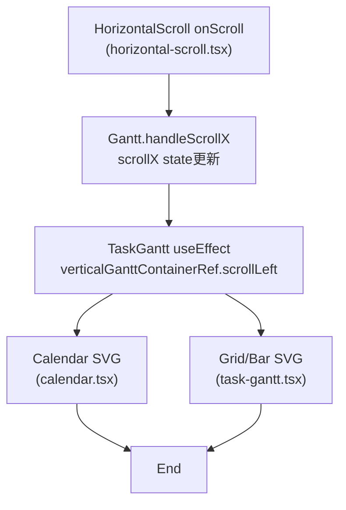

# 45-research: 追従スクロール調査

本ドキュメントは [RESEARCH] Issue における調査結果をまとめたものです。仕様の入口は [00-index.md](../00-index.md) を参照してください。

## 1. 機能要件 / 非機能要件
- 機能要件: `horizontal-scroll.tsx` から `calendar.tsx` までの追従スクロール経路を一次原因として明示する。
- 非機能要件: 変更対象は本ファイルのみとし、既存コードへの影響を与えない。

## 2. スコープと変更対象
- 変更ファイル（新規/修正/削除）: `.github/copilot/90-research/45-research.md`（新規）
- 影響範囲・互換性リスク: なし（ドキュメント追加のみ）。
- 外部依存・Secrets の扱い: 追加なし。

## 3. 設計方針
- 責務分離 / データフロー（必要なら Mermaid 1 枚）:

- エッジケース / 例外系 / リトライ方針:
  - 例外シナリオの詳細は「8.4 例外シナリオ」を参照。
- ログと観測性（漏洩防止を含む）: 追加なし。

## 4. テスト戦略
- テスト観点（正常 / 例外 / 境界 / 回帰）: 既存 `npm run test` で現状確認。
- モック / フィクスチャ方針: 追加なし。
- テスト追加の実行コマンド（例: `python -m pytest`）: `npm run test`。

## 5. CI 品質ゲート
- 実行コマンド（format / lint / typecheck / test / security）: `npm run test`（test:unit/test:lint/test:build）。
- 通過基準と失敗時の対応: 既存エラーは調査結果に明記し、修正は別 Issue で扱う。

## 6. ロールアウト・運用
- ロールバック方法: ドキュメントのみのため不要。
- 監視・運用上の注意: なし。

## 7. オープンな課題 / ADR 要否
- 未確定事項: なし。
- ADR に残すべき判断: なし。

## 8. 調査結果

### 8.1 調査対象コミット
- `git rev-parse HEAD`: `ca14abf57f43217f13a666235fa799855b9ae500`

### 8.2 追従スクロールの一次原因（horizontal-scroll.tsx → calendar.tsx）
- 誰が: `HorizontalScroll`（`src/components/other/horizontal-scroll.tsx`）
  - どの値: `event.currentTarget.scrollLeft`（`onScroll` 発火時）
  - どこへ反映: `onScroll` Prop 経由で `Gantt.handleScrollX` に伝達。
  - 関連 prop/ref/event/CSS:
    - prop: `scroll`, `svgWidth`, `taskListWidth`, `rtl`, `onScroll`
    - ref: `scrollRef`
    - event: `
`
    - CSS: `.scrollWrapper { overflow: auto; height: 1.2rem; }`（`horizontal-scroll.module.css`）
- 誰が: `Gantt`（`src/components/gantt/gantt.tsx`）
  - どの値: `scrollX` state（`useState`）を `handleScrollX` で更新。
  - どこへ反映: `scrollX` を `TaskGantt` と `HorizontalScroll` の props に渡す。
  - 関連 prop/ref/event:
    - function: `handleScrollX(event)` が `!ignoreScrollEvent` のときに `setScrollX(event.currentTarget.scrollLeft)` を実行
    - event（HorizontalScroll 由来）: `HorizontalScroll` からの `onScroll`
    - event（wrapper 由来）: `wrapperRef` に付与した `wheel` イベントリスナー `handleWheel`（Shift or 横スクロール）、`styles.wrapper` の `onKeyDown` による `handleKeyDown`
- 誰が: `TaskGantt`（`src/components/gantt/task-gantt.tsx`）
  - どの値: `scrollX` prop
  - どこへ反映: `verticalGanttContainerRef.current.scrollLeft = scrollX`
  - 関連 prop/ref/CSS:
    - ref: `verticalGanttContainerRef`
    - prop: `scrollX`
    - CSS: `.ganttVerticalContainer { overflow: hidden; }`（`gantt.module.css`）
- 誰が: `Calendar`（`src/components/calendar/calendar.tsx`）
  - どの値: `scrollX` によってスクロールされた親コンテナの `scrollLeft`
  - どこへ反映: `TaskGantt` 内 `<svg><Calendar {...calendarProps} /></svg>` が同一コンテナ内でスクロールされ、ヘッダ行が追従する。
  - 関連 prop: `CalendarProps`（`headerHeight`, `columnWidth`, `rtl`, `fontFamily`, `fontSize`）

### 8.3 本体グリッドとヘッダ行の追従経路
- 同一経路: `TaskGantt` の `verticalGanttContainerRef` で `scrollLeft` を更新し、同一コンテナ内の `<svg><Calendar /></svg>`（ヘッダ）と `
` 内のグリッド/バー（本体）が同時にスクロールする。

### 8.4 例外シナリオ（同期が成立しない可能性）
- `ignoreScrollEvent` が `true` の間は `handleScrollX` が `setScrollX` を実行しないため、`HorizontalScroll` を手動で動かした初回イベントが無視される場合、スクロールバーだけが動き `Calendar` が追従しない可能性がある（`src/components/gantt/gantt.tsx` の `handleScrollX`）。

### 8.5 example 初期画面の入口
- 入口コンポーネント: `example/src/index.tsx` が `createRoot(...).render(<App />)` で `example/src/App.tsx` を描画。
- ルーティング: ルーターは使用しておらず、単一 `App` を直接マウント。

## 9. テスト結果
- 事前確認（変更前）: `npm install && npm run test`
  - `test:unit` は成功。
  - `test:lint` で `testing-library/no-wait-for-multiple-assertions` エラーが発生し、`test:build` は未実行。
  - 失敗箇所: `src/test/split-handle.test.tsx`（Lint エラー）。
- 変更後: `npm run test`
  - `test:unit` は成功（act の非推奨警告あり）。
  - `test:lint` で同じ `testing-library/no-wait-for-multiple-assertions` エラーが発生し、`test:build` は未実行。
  - 失敗箇所: `src/test/split-handle.test.tsx`（Lint エラー）。
