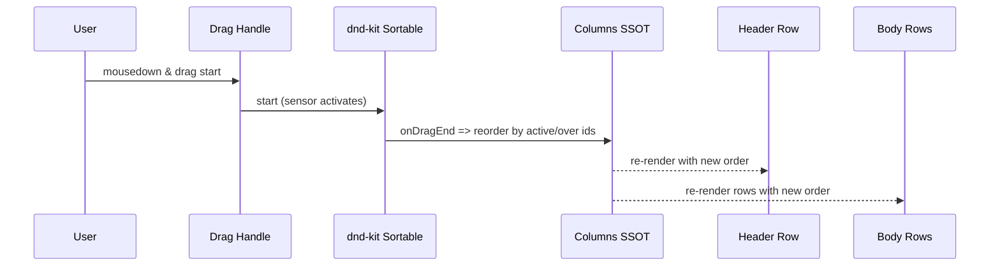
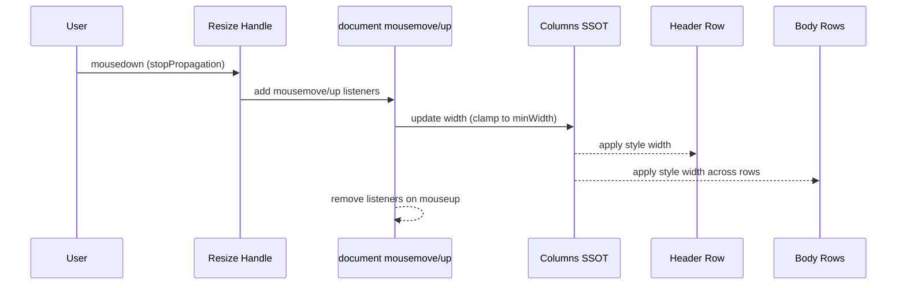

# 1. 機能要件 / 非機能要件
- 機能要件:
  - Task List / Task Table の列ヘッダに対し、Drag & Drop で列順序を変更できること。
  - 列幅を Resize 操作（mouse down/move/up）で変更でき、最小幅を下回らないこと。
  - Drag と Resize が互いに干渉しないイベント構造であること（別 DOM・別ハンドル、stopPropagation）。
  - 列情報（順序・幅・可視性）を単一の SSOT 状態で管理し、ヘッダとボディの表示が常に同期すること。
  - 既存 public API を維持しつつ型定義（Column/状態管理型）を拡張すること。
- 非機能要件:
  - ガント本体（タイムライン領域）は非対象。外部依存は Drag 用の dnd-kit に限定し、Resize はネイティブ実装とする。
  - 最小限の DOM 追加でアクセシビリティと操作性を両立する。
  - 互換性を壊さず、既存表示/挙動への影響を最小化する。

# 2. スコープと変更対象
- 変更ファイル（新規/修正/削除）:
  - 修正: `src/components/task-list/task-list-header.tsx`
  - 修正: `src/components/task-list/task-list-table.tsx`
  - 修正: `src/components/task-list/task-list.tsx`
  - 修正: `src/components/gantt/gantt.tsx`
  - 修正: `src/types/public-types.ts`
  - 追加: Drag/Resize 用のスタイルフックが必要な場合は `task-list-header.module.css` など既存 CSS を拡張
- 影響範囲・互換性リスク:
  - 列並び/幅の制御が共有状態化されるため、カスタムヘッダを提供する利用者に影響する可能性がある。既存 props は維持し、初期値も従来順序で設定することで後方互換を確保する。
  - dnd-kit 依存（`@dnd-kit/core` / `@dnd-kit/sortable` / `@dnd-kit/utilities`）を peerDependencies に明示し、`@dnd-kit/sortable` も含めて microbundle external に指定することでバンドルサイズ影響を限定的に保つ（core/utilities は既に external に指定済み）。
- 外部依存・Secrets の扱い:
  - Drag 専用で `@dnd-kit/core` / `@dnd-kit/sortable` を利用。Resize はネイティブイベント。
  - Secrets 利用なし。

# 3. 設計方針
- 責務分離 / データフロー（必要なら Mermaid 1 枚）:
  - 列状態 SSOT（例: `columnsState: ColumnState[]`）を Task List コンテナで保持し、順序/幅/表示を一括管理。ヘッダ・ボディ双方に props で配信し、同一 state を参照して描画する。
  - Drag: ヘッダ内の専用 drag-handle（dnd-kit SortableContext）で順序を更新。ボディ列レンダリングは SSOT 順序に追従。
  - Resize: ヘッダの resize-handle に `onMouseDown` を付与し、ドキュメントレベルの mousemove/up で幅を更新。最小幅を超過のみ反映。
- UI ハンドル配置と CSS:
  - Drag ハンドル: ヘッダセル左側に常設し、SVG の三本線アイコン（例: `<svg width="12" height="12">` で縦3本ライン）を表示。クラス例 `ganttTable_DragHandle`（`cursor: grab; display: inline-flex; align-items: center; padding: 0 4px;`）、ドラッグ中は `ganttTable_DragHandle--active`（`cursor: grabbing; opacity: 0.6;`）。
  - Resize ハンドル: ヘッダセル右端に 6px 程度の専用要素を配置し、クラス `ganttTable_ResizeHandle`（`cursor: col-resize; width: 6px; position: absolute; right: 0; top: 0; bottom: 0;`）。リサイズ中は `ganttTable_ResizeHandle--active` を付与し、`user-select: none; background-color: rgba(0,0,0,0.06);` で視覚フィードバック。
- 競合防止: Drag/Resize ハンドルを別 DOM とし、各ハンドルで `event.stopPropagation()` を実行。Drag センサーと Resize リスナーは独立登録。リサイズ対象はヘッダセル内の `ganttTable_ResizeHandle` で受け、`ganttTable_HeaderSeparator` は視覚的区切りのみ（イベントを持たない）とするため認識齟齬を避ける。
- エッジケース / 例外系 / リトライ方針:
  - 幅縮小が minWidth 未満の場合は clamp。ドラッグ中にリサイズイベントは発火させない（ハンドル分離）。
  - `box-sizing: border-box` をヘッダセルに適用し、padding/ハンドル幅込みで `minWidth` を評価する。padding-left/right は最小幅に含める前提で clamp を計算。
  - 非表示列（visible=false）は並び替え対象外。順序のみ保持し、再表示時に元の順序を再現。
  - dnd-kit 非対応環境でのフォールバック:
    - フォールバック条件: (1) ライブラリ利用側の feature flag で `enableColumnDrag === false` が指定された場合、(2) SSR などで `typeof window === "undefined"` の場合、(3) クライアントで `window` は存在するが `PointerEvent` が未サポートの場合（`!("PointerEvent" in window)`）。
    - 条件成立時は `DndContext` / `SortableContext` をレンダリングせず、従来順序のまま静的ヘッダを描画する。Drag ハンドルは非表示とし、Resize のみ有効とする。
    - 実装方針: dnd-kit 関連はクライアント側でのみ動的 import（コード分割）し、feature flag と環境チェックで分岐。`@dnd-kit/core` は peerDependencies 前提であり、「未インストール時フォールバック」は行わない。
- ログと観測性（漏洩防止を含む）:
  - ライブラリのため追加ログなし。現時点では新規コールバック API（例: `onColumnsChange`）は追加しないが、列変更などの観測性が課題になった場合は実装フェーズで API 追加を検討する方針とする。

# 4. テスト戦略
- テスト観点（正常 / 例外 / 境界 / 回帰):
  - 正常: Drag 操作で列順が SSOT に従い更新され、ヘッダ/ボディが同期して並び替わる。
  - 正常: Resize 操作で列幅が更新され、最小幅を下回らない。
  - 例外: Drag ハンドルと Resize ハンドルのイベントが競合しない（片方操作中にもう片方が誤作動しない）。
  - 回帰: 既存列構造・visibleFields の初期表示が維持される。
- モック / フィクスチャ方針:
  - DOM イベントを伴うため、ユニットテストではヘッダ/ボディの順序・style 幅を検証。dnd-kit はドラッグシミュレーションを最小限にモック。
- テスト追加の実行コマンド（例: `python -m pytest`）:
  - `npm test`（npm-run-all の `run-s` で `test:unit` → `test:lint` → `test:build` を順次実行）

# 5. CI 品質ゲート
- 実行コマンド（format / lint / typecheck / test / security）:
  - `npm run test:lint`
  - `npm run test:unit`
  - `npm run test:build`
- 通過基準と失敗時の対応:
  - すべて 0 エラーで完了すること。警告は既存のもののみ許容し、新規発生は修正。

# 6. ロールアウト・運用
- ロールバック方法:
  - 列状態 SSOT と Drag/Resize 追加部分を無効化し、従来の静的ヘッダ・固定幅描画に戻す。
- 監視・運用上の注意:
  - ライブラリ利用側で列設定を永続化する場合は破壊的変更を避けるため、列 ID をキーにすることをガイド。

# 7. オープンな課題 / ADR 要否
- 未確定事項:
  - 列状態外部公開 API（onColumnsChange など）を追加するかは未決。今回は内部状態のみ。
- ADR に残すべき判断:
  - dnd-kit を Drag のみで利用し、Resize はネイティブ実装に限定する方針を ADR 不要の小変更として扱う。

# 8. 付録: 型定義・シーケンス
- 型更新:
  - `type ColumnState = { id: string; label: string; width: number; minWidth: number; visible: boolean; }`
  - SSOT: `columnsState: ColumnState[]` を Task List 親で保持。ヘッダ/ボディへ渡す。
- Drag (ヘッダ並び替え) イベントシーケンス:

- Resize (列幅変更) イベントシーケンス:

本PRは設計フェーズであり、列ヘッダの Drag & Drop / Resize 設計方針を整理する計画ドキュメントのみを追加・更新する（実装コードの変更なし）。

# 9. 参照
- [00-index.md](../00-index.md)
- [10-requirements.md](../10-requirements.md)
- [20-architecture.md](../20-architecture.md)
- [40-testing-strategy.md](../40-testing-strategy.md)
- [60-ci-quality-gates.md](../60-ci-quality-gates.md)
