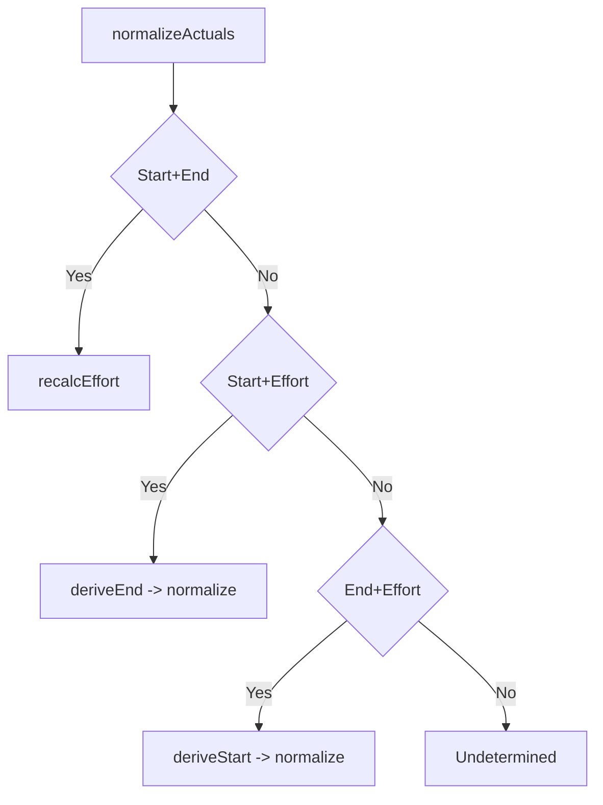

# Implementation Plan: 実績開始日/実績終了日/実績工数のバー優先連動

## 1. 機能要件 / 非機能要件
- 機能要件:
  - SSOT を (ActualStart, ActualEnd) とし、ActualEffortHours は派生値として正規化する。
  - 初期表示時に 4 パターンの補完/矛盾解決を実施し、常に矛盾ゼロの表示にする。
  - 編集時は 2 項目確定で残り 1 項目を自動更新し、バー優先（start/end）を保持する。
  - ActualEffortHours 編集時は ActualStart を固定し、稼働日計算で ActualEnd を算出する。
  - 稼働時間/日 (workHoursPerDay) は呼び出し元パラメータで指定可能とし、未指定時は 8h を既定値とする（`windowHours = workdayEndTime - workdayStartTime` の duration とし、`effectiveWorkHoursPerDay = min(workHoursPerDay, windowHours)`、差分は `breakHours = windowHours - effectiveWorkHoursPerDay` として暗黙に扱う）。
  - 業務開始/終了時刻 (workdayStartTime/workdayEndTime) を呼び出し元パラメータで指定可能とし、未指定時は 09:00〜18:00 を既定値とする（9h 窓に対して workHoursPerDay 既定 8h を想定し、休憩は明示指定で調整する）。
  - workdayStartTime/workdayEndTime は `"HH:mm"` 形式の文字列で受け取り、タスクの日時と同じローカルタイムゾーンで解釈する（例: `"09:00"`）。
  - 期間は [ActualStart, ActualEnd) の半開区間とし、ActualEffortHours は `q = effort / 0.25` に対して `normalized = Math.floor(q + 0.5) * 0.25` を適用する（round-half-up を明示し、0.5 は上方向）。例: 1.12→1.00、1.13→1.25。
- 非機能要件:
  - 正規化は冪等で、高頻度呼び出しに耐える軽量な計算であること。
  - ログ/表示に Secrets/PII を含めない。
  - 既存 UI/データ互換を壊さず、既存バー表示と一致すること。

## 2. スコープと変更対象
- 変更ファイル（新規/修正/削除）:
  - 新規:
    - `src/helpers/actuals-helper.ts`（正規化/補完/丸めの専用ユーティリティ）
  - 修正:
    - `src/types/public-types.ts`（Task に actualStart/actualEnd を追加、正規化オプション workHoursPerDay/workdayStartTime/workdayEndTime を追加）
    - `src/helpers/task-helper.ts`（actualStart/actualEnd の入出力サポート）
    - `src/components/gantt/gantt.tsx`（tasks 受信時の正規化適用）
    - `src/components/task-list/task-list.tsx`（編集確定時に正規化を適用）
    - `src/components/task-list/task-list-table.tsx`（実績開始/終了の表示列追加）
    - `src/components/task-list/overlay-editor.tsx`（実績開始/終了/工数の編集対応）
    - `src/test/task-list-table-editing.test.tsx`（編集時正規化の回帰テスト）
    - `src/test/task-model.test.tsx`（actualStart/actualEnd シリアライズ/表示の回帰テスト）
- 影響範囲・互換性リスク:
  - Task Table の実績表示、Gantt 実績バー、ロード時の既存データ表示が影響範囲。
  - 既存データの ActualEffortHours がバーと矛盾する場合、ロード時に補正される。
- 外部依存・Secrets の扱い:
  - 稼働日カレンダー、1人固定の前提に依存し、1日あたりの稼働時間は workHoursPerDay で指定 (未指定時は 8h を既定値とする)。
  - 業務時間帯は workdayStartTime/workdayEndTime で指定 (未指定時は 09:00〜18:00 を既定値とする)。
  - Secrets/PII は扱わない。

## 3. 設計方針
- 責務分離 / データフロー（必要なら Mermaid 1 枚）:
  - 正規化ロジックは純粋関数として実装し、UI からは `normalizeActuals` を呼び出す。
  - 正規化は `recalcEffort`, `deriveEnd`, `deriveStart`, `roundEffortToQuarterHour` に責務分割する。
  - 半開区間を前提に稼働日カレンダー計算 API を利用する。
  - `normalizeActuals` の引数で `workHoursPerDay` と `calendarConfig`（既存の `CalendarConfig` と同義の稼働日/休日設定）、`workdayStartTime`/`workdayEndTime` を受け取り、Gantt の props から既定値 (8h, 09:00〜18:00) を注入する。
  - 呼び出しタイミング:
    - 初期表示/再描画: `Gantt` の tasks 受信時に `normalizeActuals` を適用し、正規化後の tasks で `ganttDateRange` と `convertToBarTasks` を生成する。
    - 編集確定時: `TaskList` の `commitEditing` で該当タスクに `normalizeActuals` を適用し、正規化済みの差分を `onUpdateTask` / `onCellCommit` へ渡す。
    - ガントバー操作: ガントのドラッグ/リサイズで `onDateChange` が発火し、ホスト側で更新した tasks が再投入されたタイミングで `normalizeActuals` を適用する（`onDateChange` の通知は正規化前。ホスト側で同じ正規化を適用してから tasks を更新してもよい）。
    - 外部更新: API 再取得や親コンポーネントの更新でも tasks prop の更新で同じ正規化が走る（冪等前提）。

- エッジケース / 例外系 / リトライ方針:
  - ActualStart/ActualEnd のパース不能・範囲外・start > end は「欠落」と同等に扱い、初期表示の補完順序に従う。
  - ActualEffortHours が負数/NaN は欠落扱いとし補完を試みる。
  - ActualEffortHours=0 は start=end を許容し、半開区間のため effort は 0 として扱う。
  - 非稼働日跨ぎはカレンダー API に委譲し、加算/差分計算は稼働日のみを対象にする。
  - workHoursPerDay が未指定/0 以下/NaN の場合は既定値 8h にフォールバックする。
  - workHoursPerDay が業務時間帯の長さ（workdayStartTime/workdayEndTime を時間差に換算した値）を超える場合は、`effectiveWorkHoursPerDay = windowHours` を適用して計算し、console.warn で設定不整合を通知する。
  - workdayStartTime/workdayEndTime が未指定/不正/逆転の場合は既定値 09:00〜18:00 にフォールバックする。
  - end 算出/丸めは業務時間帯内で完結させ、丸め後の end が workdayEndTime を超える場合は次稼働日の workdayStartTime に繰り越す。
    - 繰り越しは `overflow = roundedEnd - workdayEndTime`（roundedEnd は datetime、workdayEndTime は同日の時刻に変換し、時間差を分/時の duration として扱う）とし、次稼働日の `workdayStartTime + overflow` を end とする（例: effort を 0.5h=30分 に丸めた結果 17:45→18:15 になった場合、overflow は 0:15 なので翌稼働日の 09:15 にする）。
- ログと観測性（漏洩防止を含む）:
  - 既存の console.debug / console.warn の構造化ログ方針に合わせる。
  - 無効値補完や矛盾補正時は rowId・フィールド名・原因のみをログに出し、値本文は必要最小限にする。

## 4. テスト戦略
- テスト観点（正常 / 例外 / 境界 / 回帰）:
  - 初期表示 4 パターン: Start+End, Start+Effort, End+Effort, どれも無い。
  - 編集時 3 パターン: Start 編集, End 編集, Effort 編集。
  - workHoursPerDay の変更: 6h/8h/10h で end 算出が変わることを確認。
  - workdayStartTime/workdayEndTime の変更: 08:00〜17:00/09:00〜18:00/10:00〜19:00 で丸め後の end が業務時間内に収束することを確認。
  - 0.25h 丸めを確認:
    - 1.12→1.00、1.13→1.25。
    - 1.37→1.25、1.38→1.50。
    - 境界条件: effort/0.25 の小数部が 0.5 以上で上方向（1.124→1.00、1.125→1.25）。
    - 境界値: 1.125→1.25、1.375→1.50、1.625→1.75、1.875→2.00。
    - 境界直前/直後: 1.124→1.00、1.126→1.25、1.374→1.25、1.376→1.50。
  - 祝日/非稼働日を含む期間での effort 再計算/ end 算出。
  - 無効値（NaN/負数/start>end）入力時の欠落扱い。
- モック / フィクスチャ方針:
  - 稼働日カレンダーは既存ユーティリティのモックを用い、固定カレンダーで期待値を確定させる。
- テスト追加の実行コマンド（例: `python -m pytest`）:
  - `npm run test:unit` (必要に応じて `npm test` で lint/build を含めて実行)

## 5. CI 品質ゲート
- 実行コマンド（format / lint / typecheck / test / security）:
  - lint/build/test: `npm test` (`test:unit` + `test:lint` + `test:build`)
  - security: `npm audit` (既存 CI 運用に合わせて実行)
- 通過基準と失敗時の対応:
  - すべてのテストが green であること。失敗時は正規化計算/丸め/稼働日処理を見直す。

## 6. ロールアウト・運用
- ロールバック方法:
  - 正規化ロジックを導入したコミットをリバートし、既存表示に戻す。
- 監視・運用上の注意:
  - 既存データの effort がロード時に補正される可能性をリリースノートで周知する。

## 7. オープンな課題 / ADR 要否
- 未確定事項:
  - なし。
- ADR に残すべき判断:
  - なし (本仕様で SSOT/丸め/半開区間が確定済み)。
