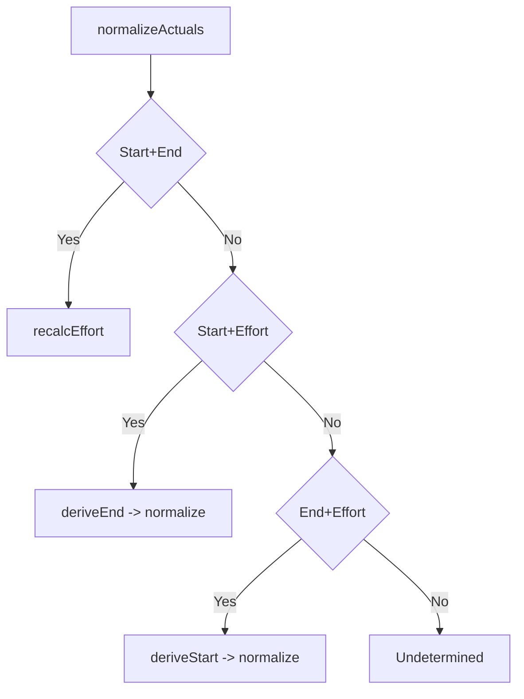

# Implementation Plan: 実績開始日/実績終了日/実績工数のバー優先連動

## 1. 機能要件 / 非機能要件
- 機能要件:
  - SSOT を (ActualStart, ActualEnd) とし、ActualEffortHours は派生値として正規化する。
  - 初期表示時に 4 パターンの補完/矛盾解決を実施し、常に矛盾ゼロの表示にする。
  - 編集時は 2 項目確定で残り 1 項目を自動更新し、バー優先（start/end）を保持する。
  - ActualEffortHours 編集時は ActualStart を固定し、稼働日計算で ActualEnd を算出する。
  - 期間は [ActualStart, ActualEnd) の半開区間とし、ActualEffortHours は 0.25h 刻みの下限からの端数 (effort % 0.25) が 0.125h 未満なら切り捨て、0.125h 以上なら切り上げる (例: 1.12→1.00、1.13→1.25)。
- 非機能要件:
  - 正規化は冪等で、高頻度呼び出しに耐える軽量な計算であること。
  - ログ/表示に Secrets/PII を含めない。
  - 既存 UI/データ互換を壊さず、既存バー表示と一致すること。

## 2. スコープと変更対象
- 変更ファイル（新規/修正/削除）:
  - 新規: `.github/copilot/plans/41-actuals-linkage-bar-priority-spec.md`
- 影響範囲・互換性リスク:
  - Task Table の実績表示、Gantt 実績バー、ロード時の既存データ表示が影響範囲。
  - 既存データの ActualEffortHours がバーと矛盾する場合、ロード時に補正される。
- 外部依存・Secrets の扱い:
  - 稼働日カレンダー、1日8時間、1人固定の前提に依存。
  - Secrets/PII は扱わない。

## 3. 設計方針
- 責務分離 / データフロー（必要なら Mermaid 1 枚）:
  - 正規化ロジックは純粋関数として実装し、UI からは `normalizeActuals` を呼び出す。
  - 正規化は `recalcEffort`, `deriveEnd`, `deriveStart`, `roundEffortToQuarterHour` に責務分割する。
  - 半開区間を前提に稼働日カレンダー計算 API を利用する。

- エッジケース / 例外系 / リトライ方針:
  - ActualStart/ActualEnd のパース不能・範囲外・start > end は「欠落」と同等に扱い、初期表示の補完順序に従う。
  - ActualEffortHours が負数/NaN は欠落扱いとし補完を試みる。
  - ActualEffortHours=0 は start=end を許容し、半開区間のため effort は 0 として扱う。
  - 非稼働日跨ぎはカレンダー API に委譲し、加算/差分計算は稼働日のみを対象にする。
- ログと観測性（漏洩防止を含む）:
  - 既存の console.debug / console.warn の構造化ログ方針に合わせる。
  - 無効値補完や矛盾補正時は rowId・フィールド名・原因のみをログに出し、値本文は必要最小限にする。

## 4. テスト戦略
- テスト観点（正常 / 例外 / 境界 / 回帰）:
  - 初期表示 4 パターン: Start+End, Start+Effort, End+Effort, どれも無い。
  - 編集時 3 パターン: Start 編集, End 編集, Effort 編集。
  - 0.25h 丸めを確認:
    - 1.12→1.00、1.13→1.25。
    - 1.37→1.25、1.38→1.50。
    - 境界値: 1.125→1.25、1.375→1.50、1.625→1.75、1.875→2.00。
  - 祝日/非稼働日を含む期間での effort 再計算/ end 算出。
  - 無効値（NaN/負数/start>end）入力時の欠落扱い。
- モック / フィクスチャ方針:
  - 稼働日カレンダーは既存ユーティリティのモックを用い、固定カレンダーで期待値を確定させる。
- テスト追加の実行コマンド（例: `python -m pytest`）:
  - `npm run test:unit` (必要に応じて `npm test` で lint/build を含めて実行)

## 5. CI 品質ゲート
- 実行コマンド（format / lint / typecheck / test / security）:
  - lint/build/test: `npm test` (`test:unit` + `test:lint` + `test:build`)
  - security: `npm audit` (既存 CI 運用に合わせて実行)
- 通過基準と失敗時の対応:
  - すべてのテストが green であること。失敗時は正規化計算/丸め/稼働日処理を見直す。

## 6. ロールアウト・運用
- ロールバック方法:
  - 正規化ロジックを導入したコミットをリバートし、既存表示に戻す。
- 監視・運用上の注意:
  - 既存データの effort がロード時に補正される可能性をリリースノートで周知する。

## 7. オープンな課題 / ADR 要否
- 未確定事項:
  - なし。
- ADR に残すべき判断:
  - なし (本仕様で SSOT/丸め/半開区間が確定済み)。
